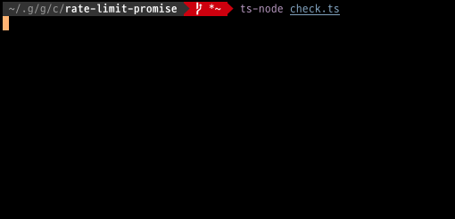

rate-limit-delay-promise
===

A library that performs rate limiting when executing a list of asynchronous processes.


Install
---

```
$ npm install rate-limit-delay-promise
```

Usage
---

Call `RateLimitDelayPromise.all()` instead of `Promise.all()`.

### Before

```typescript
function main() {
    const masters = [1,2,3];
    const promises: Promise<string>[] = masters.map(DummyRemoteProcess.requestMaster);
    Promise.all(promises).then(console.log);
}

class DummyRemoteProcess {
    static requestMaster(master: number): Promise<string> {
        switch (master) {
            case 1:
                return Promise.resolve('one');
            case 2:
                return Promise.resolve('two');
            case 3:
                return Promise.resolve('three');
            default:
                throw new Error('Invalid master number');
        }
    }
}
main();
```

It is very useful, but if the external API `requestMaster` has a rate limit, you need a mechanism to reduce the frequency of requests. Use the library as follows:


### After


```typescript
import { RateLimitDelayPromise } from 'rate-limit-delay-promise';

function limitMain(){
    const masters = [1,2,3];
    RateLimitDelayPromise.all(masters, DummyRemoteProcess.requestMaster, 2000)
        .then(console.log);
}

class DummyRemoteProcess {
    static requestMaster(master: number): Promise<string> {
        switch (master) {
            case 1:
                return Promise.resolve('one');
            case 2:
                return Promise.resolve('two');
            case 3:
                return Promise.resolve('three');
            default:
                throw new Error('Invalid master number');
        }
    }
}
limitMain();
```

`$ ts-node check.ts`

;

**!!WARNING:** Overall execution time will be increased by your delay, of course.

License
---
MIT
